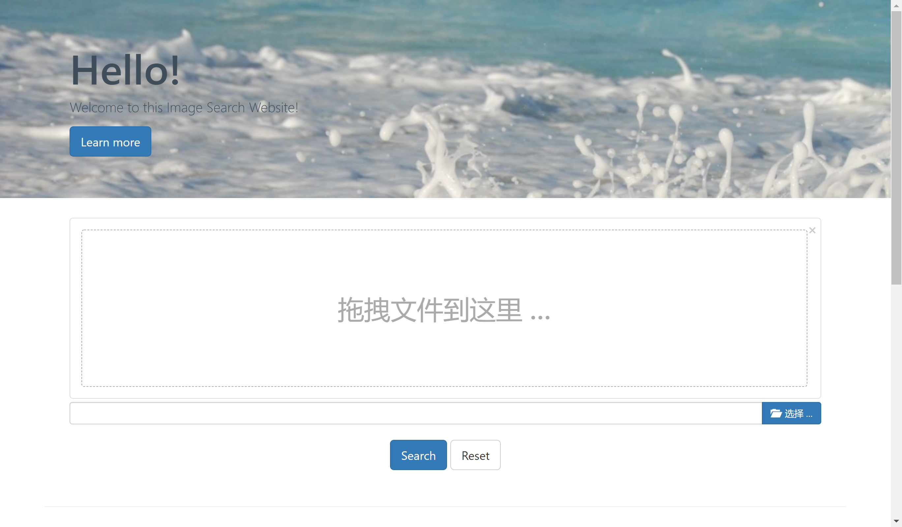

# Lab 2

This project demonstrates, how we can make use of deep learning to do state-of-the-art image similarity search. I have used tensorflow and some publicly available datasets.

[TOC]


## Development Environment

+ **Development Environment:** Win 10

- **Development Software:**
  1. **PyCharm** 2021.1.1
  2. **Visual Studio Code** 1.56.2
- **Development Language:**
  1. python3.7
  2. HTML
  3. JavaScript
  4. CSS
- **Mainly Reference Count:**
  1. flask (Flask, jsonify)
  2. flask_httpauth (HTTPBasicAuth)
  3. tensorflow
  4. numpy
- **Others:**
  1. Bootstrap 3.4.1

## How to run this program

1. Download this [file](https://sse.tongji.edu.cn/yingshen/course/HCI2021Spring/slides/lab2-image%20retrieval.zip) and extract the it in English path.

2. Run image vectorizer which passes each data through an inception-v3 model and collects the bottleneck layer vectors and stores in disc. Edit dataset paths accordingly indide the image_vectorizer.py

   ```
   python server/image_vectorizer.py 
   ```

   This will generate two files namely, image_list.pickle and saved_features.txt. Keep them inside lib folder where search.py script is available.

3. Add some code to search.py.

   This code is to get the tag of picture.

   ```python
   def getClass(img_name):
       rootdir="./database/tags"
       file_list=os.listdir(rootdir)
       for i in range(len(file_list)):
           file_path=os.path.join(rootdir,file_list[i])
           if os.path.isfile(file_path):
               with open(file_path,"r") as f:
                   for tup in f:
                       tup = tup[:-1]
                       if tup == img_name[10:-4]:
                           return file_list[i].split(".")[0]
   ```

   And add import in rest-server.py

   ```python
   from search import getClass
   ```

   Change upload_img function in rest-server.py.

   ```python
   def upload_img():
       print("image upload")
       result = 'static/result'
       if not gfile.Exists(result):
           os.mkdir(result)
       shutil.rmtree(result)
   
       if request.method == 'POST' or request.method == 'GET':
           print(request.method)
           # check if the post request has the file part
           if 'file' not in request.files:
               print('No file part')
               return redirect(request.url)
   
           file = request.files['file']
           print(file.filename)
           # if user does not select file, browser also
           # submit a empty part without filename
           if file.filename == '':
               print('No selected file')
               return redirect(request.url)
           if file:  # and allowed_file(file.filename):
               filename = secure_filename(file.filename)
               file.save(os.path.join(app.config['UPLOAD_FOLDER'], filename))
               inputloc = os.path.join(app.config['UPLOAD_FOLDER'], filename)
               recommend(inputloc, extracted_features)
               os.remove(inputloc)
               image_path = "/result"
               image_list = [os.path.join(image_path, file) for file in os.listdir(result)
                             if not file.startswith('.')]
   
               # 获取标签
               count = 0
               images = {}
               tags = []
               for img in image_list:
                   tag = getClass(img)
                   print(tag)
                   if tag not in tags:
                       tags.append(tag)
                   images['image' + str(count)] = {
                       "url": image_list[count],
                       "tag": tag
                   }
                   count+=1
   
               images["tags"] = tags
               images["total_item"] = count
   
               return jsonify(images)
   ```

4. Start the server by running rest-server.py. This project uses flask based REST implementation for UI.

   ```
   python server/rest-server.py 
   ```

5. Once the server starts up, access the url http://100.66.64.149:5000  to get the UI. Now upload any file and see some similar images.

## How to use this website

Home Page



1. Put the image in the designated area.

   

2. Push the search button.

   

   wait for a moment...

3. The page will automatically go to the search results location.

   

4. Push the "收藏" button 

   

   and you will see it in "Favorite Images" area.

   

5. Push the same "收藏" button again will remove it from "Favorite Images".

   

6. Click Sort by button, and choose the tag you want to filt, then only the image with the chosn tag will show on your screen.

   

