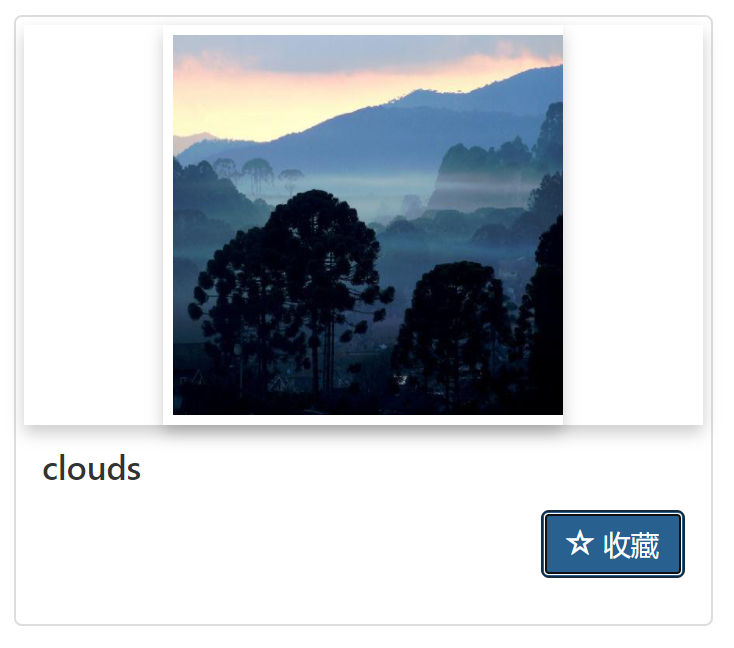

# Lab 2 Report

Image Retrieval

## Contents

+ Describe the requirements of an image search task;
+ Show your designs for five stages and give a brief description for features that you implement.
  + Formulation
  + Initiation of action
  + Review of results
  + Refinement
  + Use

## Describe The requirements of an image search task

+ It contains a page which could tell user how to use this image search website;

+ It contains an input box to upload an image;
+ It has a search button;
+ It has a loading logo, which help user to know what the engine is doing;
+ Users can preview the query image in the searching window;
+ Provide an overview of the results, such as the total number of results and the total time cost in searching;
+ Allow selecting certain category/tag when reviewing results;
+ Users can add selected images to a favorite list or remove selected images from favorite list.

## five stages and features that I implement.

#### Formulation

+ It contains a page which could tell user how to use this image search website;

  

+ It contains an input box to upload an image;

  

+ Users can preview the query image in the searching window;

  

#### Initiation of action

+ It has a search button;

  

#### Review of results

+ Provide an overview of the results, such as the total number of results and the total time cost in searching;

  

#### Refinement

+ Allow selecting certain category/tag when reviewing results;

  

#### Use

+ Users can add selected images to a favorite list or remove selected images from favorite list.

  

  

   

  showing in favorite list

  